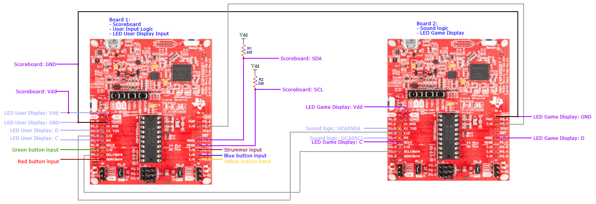
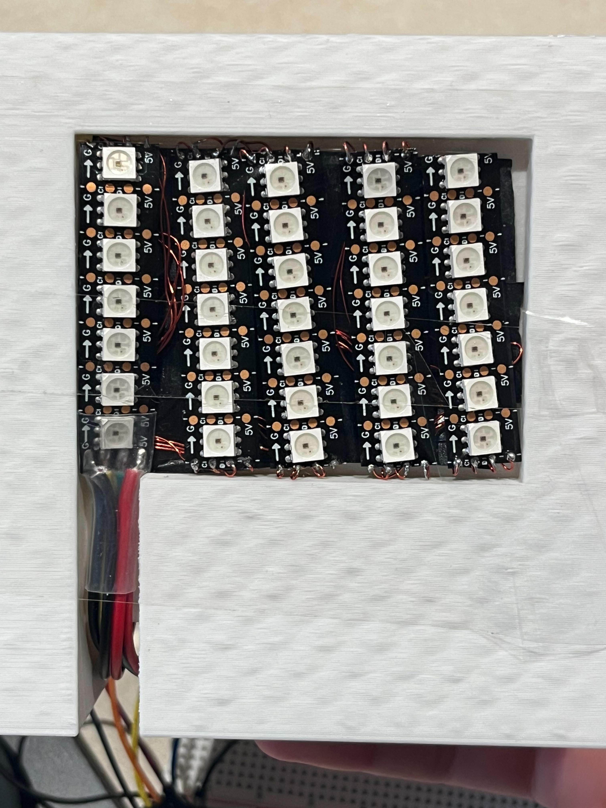
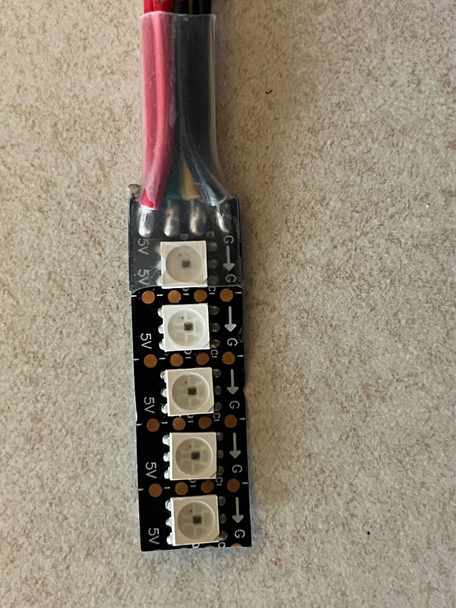

# Guitar Hero 430
### Rice University ELEC 327 Final Project Spring '24

## Table of Contents
1. [Project Description](#project-description)
2. [Team Members](#team-members)
3. [Materials](#materials)
4. [File Descriptions](#file-descriptions)
5. [Setting up the Hardware](#setting-up-the-hardware)
   - [Schematic](#schematic)
   - [LED Game Display Setup Guide](#led-game-display-setup-guide)
   - [LED User Display Setup Guide](#led-user-display-setup-guide)
   - [3D-printed Strummer]()
   - [3d-printed LED game display]()
6. [Installation](#installation)
7. [References](#references)

## Project Description 
This project aims to ecreate the experience of playing the iconic Guitar Hero using MSP430 microcontrollers. Inspired by the popular rhythm-based video game, this project combines hardware interfacing, LED visualization, audio processing, and gameplay logic to create an experience playing along with your favorite songs.

Using two TI LaunchPad Kits with MSP430 (MSP-EXP430G2ET), the project simulates the Guitar Hero gameplay. One LaunchPad serves as the game controller, managing gameplay logic and capturing user input, while providing real-time feedback through an LED display. The other LaunchPad controls LED visualizations and audio output for the song.

### Team Members
- Natalia Mendiola | nm58@rice.edu
- Lindsey Russ     | ltr1@rice.edu
  
---
### Materials

* 2x computers 
* 2x TI LaunchPad Kit with MSP430 (MSP-EXP430G2ET)
* 2x 330 Ω Resistors
* 1x SunFounder I2C LCD1602 Module
* SK9822 LED Strips
* Solderless Breadboard
* Jumper wires
* Enameled wire

### Required Software Packages

* **Code Composer Studio (CSS)**
  - Install Code Composer Studio on two separate computers. Download it from [here](https://www.ti.com/tool/download/CCSTUDIO/12.7.0).
  
* **Python**
  - This project is compatible with Python 3.11.x. Make sure you have Python 3.11.x installed on your system before installing the required packages.

  To install the required Python packages, run the following command in your terminal or command prompt:


```python
pip install -r requirements.txt
```
----
## File Descriptions

### Board_1

* **Game Logic:**
  - [main.c](./board1/main.c): Handles game logic and user inputs.
 
* **User LED Display Logic:**
  - [rgb_interface_user.c](./board1/rgb_interface_user.c): Controls RGB LEDs via SPI communication.
  - [rgb_interface_user.h](./board1/rgb_interface_user.h): Header file for RGB interface.

* **Scoreboard LCD Display Logic:**
  - [i2c.c](./board1/i2c.c): Initializes and transmits data over the I2C bus.
  - [i2c.h](./board1/i2c.h): Header file for I2C communication.
    
  - [lcd.c](./board1/lcd.c): Implements functions for interacting with an LCD display using I2C communication.
  - [lcd.h](./board1/lcd.h): Header file for LCD interface.

### Board 2

* **XXXX Logic:**
  - [main.c](./board2/main.c): File handling 

* **LED Game Display Logic:**
  - [rgb_interface.c](./board2/rgb_interface.c): File handling 
  - [rgb_interface.h](./board2/rgb_interface.h): Header file for

* **Audio:**
  - [receive_audio.py](./board2/receive_audio.py): 
  - [PlaySong.c](./board2/PlaySong.c): File handling 
  - [PlaySong.h](./board2/PlaySong.h): Header file for
  - [Rock Band 4  Fortunate Son  Creedence Clearwater Revival  Full Band HD.mp3](./board2/Rock Band 4  Fortunate Son  Creedence Clearwater Revival  Full Band HD.mp3): Song 1
  - [](): Song 2

---

## Setting up the hardware

### Schematic


### LED Game Display Setup Guide
<div style="text-align:center">
  
</div>


#### Components Needed:
- SK9822 LED strips
- Jumper wires (male-to-female)
- Enameled wire
- Heat shrink tubing
- Electrical Tape

#### Instructions:
1. **Prepare the LED Strip:**
   - Cut five 7-LED long strips from the SK9822 LED strip.
   
2. **Solder Jumper Wires:**
   - For only ONE LED strip, solder four jumper wires to one end:
     - G (Ground)
     - C (Clock)
     - D (Data)
     - 5V (Power)
   
3. **Attach Female Connectors:**
   - (if not already present) Solder female connectors to the other end of the jumper wires for this LED strip.

4. **Connect LED Strips:**
   - For the remaining four strips, connect each strip to the previous one using enameled wire:
     - Connect G to G, C to C, D to D, and 5V to 5V.
     - Hide the enameled wire connections behind the LED strips.
     - Daisy-chain the five LED strips together, ending with the jumper wires side.


5. **Secure Connections:**
   - Use electrical tape to secure the enameled wire connections behind the LED-facing side of the LED strips, forming a 5x7 LED rectangular shape.
   - Use heat shrink tubing to insulate and secure the jumper wire soldered connections.

### LED User Display Setup Guide
<div style="text-align:center">
    
</div>

#### Components Needed:
- SK9822 LED strips
- Jumper wires (male-to-female)
- Heat shrink tubing

#### Instructions:
1. **Prepare the LED Strip:**
   - Cut a 5 LED long strip from the SK9822 LED strip.
   
2. **Solder Jumper Wires:**
   - Solder four jumper wires to one end of the LED strip:
     - One wire for G (Ground)
     - One wire for C (Clock)
     - One wire for D (Data)
     - One wire for 5V (Power)
   
3. **Attach Female Connectors:**
   - (if not already present) Solder female connectors to the other end of the jumper wires.
   
4. **Secure Connections:**
   - Use heat shrink tubing to insulate and secure the soldered connections.

#### Usage:
- Connect the female connectors to the corresponding male connectors on your control board or microcontroller.

#### Notes:
- Handle the soldering iron and heat shrink tubing carefully to prevent injuries or damage to components.
  
---

## Installation

Once you have set up the boards as per the [schematic](./images/Schematic_guitarhero.png)

1. **Install Code Composer Studio:**
 - Download and install [Code Composer Studio](https://www.ti.com/tool/download/CCSTUDIO/12.7.0) on your computer.

2. **Create Projects for Each Board**
- OpenCode Composer Studio
- Create a separate project for each board.
- Set the target device to MSP430G2553 for each project.

3. **Run receive_audio.py Script:**
   - Run the receive_audio.py script on the same computer connected to board 2.

4. **Have fun!**

---

## References

1. **ADD GUITAR STRUM LINK HERE**
2. - Modified code by Dr.Joseph Young based on [I2C Display and MSP430](https://github.com/andrei-cb/I2C-Display-and-MSP430/tree/master) by Andrei-cb.
