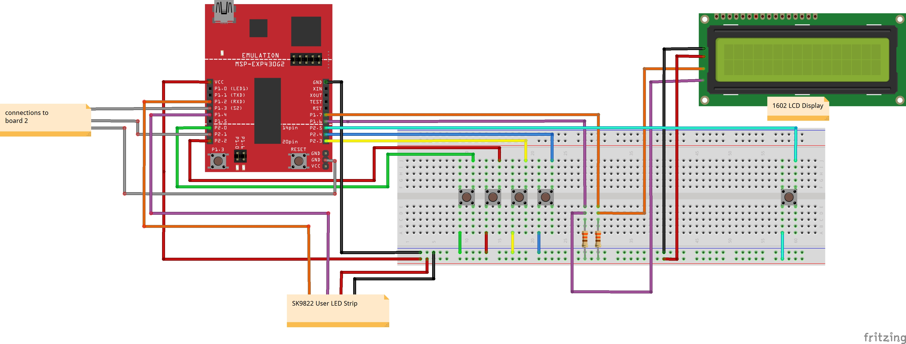
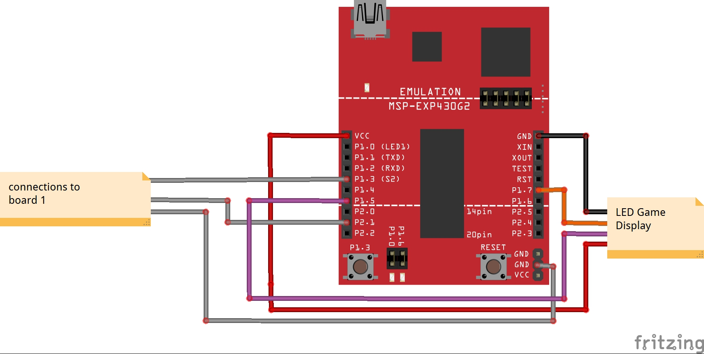

# Guitar Hero 430
## Rice University ELEC 327 Final Project Spring '24

## Project Description 
This project aims to recreate the experience of playing the iconic Guitar Hero using MSP430 microcontrollers. Inspired by the popular rhythm-based video game, this project combines hardware interfacing, LED visualization, audio processing, and gameplay logic to create an experience playing along with your favorite songs.

Using two TI LaunchPad Kits with MSP430 (MSP-EXP430G2ET), the project simulates the Guitar Hero gameplay. One LaunchPad serves as the game controller, managing gameplay logic and capturing user input, while providing real-time feedback through an LED display. The other LaunchPad controls LED visualizations and audio output for the song.

Upon starting the game, users are greeted with an introduction sequence. They can select song 1 by pressing the green button or song 2 by pressing the blue button. During gameplay, missing too many notes results in a loss sequence. However, achieving a streak of a certain number of notes resets the missed notes counter, akin to the rock meter in Guitar Hero. Successfully completing the entire song triggers a win sequence.

Check out a demo of the project [here](https://youtu.be/caU7hopNlVo)!

## Table of Contents
1. [Project Description](#project-description)
2. [Team Members](#team-members)
3. [Materials](#materials)
4. [File Descriptions](#file-descriptions)
5. [Setting up the Hardware](#setting-up-the-hardware)
   - [LED Game Display Setup Guide](#led-game-display-setup-guide)
   - [LED User Display Setup Guide](#led-user-display-setup-guide)
   - [3D-Printed Strummer & LED Game Display Case Setup Guide](#3D-Printed-Strummer-&-LED-Game-Display-Case-Setup-Guide)
   - [Schematic](#schematic)
6. [Installation](#installation)
7. [References](#references)

### Team Members
- Natalia Mendiola | nm58@rice.edu
- Lindsey Russ     | ltr1@rice.edu
  
---
### Materials

* 2x computers 
* 2x TI LaunchPad Kit with MSP430 ([MSP-EXP430G2ET](https://www.ti.com/lit/ug/slau144k/slau144k.pdf?ts=1714088213447&ref_url=https%253A%252F%252Fcanvas.fau.edu%252Fcourses%252F150016%252Fmodules%252Fitems%252F4495109))
* 2x 330 Ω Resistors
* 1x SunFounder I2C LCD1602 Module _(we used [this](https://www.sunfounder.com/products/i2c-lcd1602-module))_
* 5x Push Buttons _(we used [these](https://www.amazon.com/Gikfun-12x12x7-3-Tactile-Momentary-Arduino/dp/B01E38OS7K/ref=sr_1_2?crid=1BE52GTS4MTKX&dib=eyJ2IjoiMSJ9.4zX-flfGXZr8jlDco1mWeZYpxLLG_2EWerjmDDqog71ZnI1OvLfxdG3xoDqHAJZiIj2C_4yvfYs2xRb2uH9opQckYicLsBDibrBWU3C4XSzAQVv-ejoIkZcafnErnJzBfD5Ixq346FvzEPgK0szA49GmiNLE_MU0ial_IizxfgEKaOd04b7iSfch4QCNpIzbc0g_jbnI-Agmikl8tcAXB-vn-F69y-uOJmeLCfMDBow.GyZNhAp_2xBhutbq7NcqYsb267Lm3wUAX68IgxXEko0&dib_tag=se&keywords=gikfun+12x12x7.3+mm+tact+tactile+push+button&qid=1711663032&sprefix=gikfun+12x12x7.3+mm+tact+tactile+push+button%2Caps%2C80&sr=8-2) )_
* SK9822 LED Strips
* Solderless Breadboard
* Jumper wires
* Enameled wire

### Required Software Packages

* **Code Composer Studio (CSS)**
  - Install Code Composer Studio on two separate computers. Download it from [here](https://www.ti.com/tool/download/CCSTUDIO/12.7.0).
* **Python**
  - This project is compatible with Python 3.11.x. Make sure you have Python 3.11.x installed on your system before installing the required packages. To install the required Python packages, run the following command in your terminal or command prompt:
   ```python
   pip install -r requirements.txt
   ```
----
## File Descriptions

### Board 1:

* **Game Logic:**
  - [main.c](./board1/main.c): Handles game logic and user inputs.
    
* **User LED Display Logic:**
  - [rgb_interface_user.c](./board1/rgb_interface_user.c): Controls RGB LEDs via SPI communication.
  - [rgb_interface_user.h](./board1/rgb_interface_user.h): Header file for RGB user interface.
    
* **Scoreboard LCD Display Logic:**
  - [i2c.c](./board1/i2c.c): Initializes and transmits data over the I2C bus.
  - [i2c.h](./board1/i2c.h): Header file for I2C communication.
  - [lcd.c](./board1/lcd.c): Implements functions for interacting with an LCD display using I2C communication.
  - [lcd.h](./board1/lcd.h): Header file for LCD interface.

### Board 2:

* **Game Audio and Visual Logic:**
  - [main.c](./board2/main.c): Handles receiving communication from Board 1 to trigger events on the 5x7 LED screen and play MP3 files

* **LED Game Display Logic:**
  - [rgb_interface.c](./board2/rgb_interface.c): Controls the 5x7 LED Screen via SPI communication
  - [rgb_interface.h](./board2/rgb_interface.h): Header file for RGB interface

* **Audio:**
  - [receive_audio.py](./board2/receive_audio.py): Reads in data from the COM port to trigger the MP3 files playing and stopping
  - [PlaySong.c](./board2/PlaySong.c): Sends out the information to the COM port using UART communication to trigger the python file
  - [PlaySong.h](./board2/PlaySong.h): Header file for PlaySong
  - [Rock_Band_4_Fortunate_Son_Creedence_Clearwater_Revival_Full_Band_HD.mp3](./board2/Rock_Band_4_Fortunate_Son_Creedence_Clearwater_Revival_Full_Band_HD.mp3): Song 1
  - [Guitar_Hero_3_Mississippi_Queen.mp3](./board2/Guitar_Hero_3_Mississippi_Queen.mp3): Song 2
  - [win_sound_effect.mp3](./board2/win_sound_effect.mp3): Winning sound effect
  - [loss_sound_effect.mp3](./board2/loss_sound_effect.mp3): Losing sound effect

---

## Setting up the hardware

### LED Game Display Setup Guide
<div style="text-align:center">
  
</div>

#### Components Needed:
   - SK9822 LED strips
   - Jumper wires (male-to-female)
   - Enameled wire
   - Heat shrink tubing
   - Electrical Tape

#### Instructions:
1. **Prepare the LED Strip:**
   - Cut five 7-LED long strips from the SK9822 LED strip.
2. **Solder Jumper Wires:**
   - For only ONE LED strip, solder four jumper wires to one end:
     - G (Ground)
     - C (Clock)
     - D (Data)
     - 5V (Power)
3. **Attach Female Connectors:**
   - (if not already present) Solder female connectors to the other end of the jumper wires for this LED strip.
4. **Connect LED Strips:**
   - For the remaining four strips, connect each strip to the previous one using enameled wire:
     - Connect G to G, C to C, D to D, and 5V to 5V.
     - Hide the enameled wire connections behind the LED strips.
     - Daisy-chain the five LED strips together, ending with the jumper wires side.
5. **Secure Connections:**
   - Use electrical tape to secure the enameled wire connections behind the LED-facing side of the LED strips, forming a 5x7 LED rectangular shape.
   - Use heat shrink tubing to insulate and secure the jumper wire soldered connections.
#### Notes:
   - Handle the soldering iron and heat shrink tubing carefully to prevent injuries or damage to components.

### LED User Display Setup Guide
<div style="text-align:center">
    
</div>

#### Components Needed:
   - SK9822 LED strips
   - Jumper wires (male-to-female)
   - Heat shrink tubing

#### Instructions:
1. **Prepare the LED Strip:**
   - Cut a 5 LED long strip from the SK9822 LED strip.
2. **Solder Jumper Wires:**
   - Solder four jumper wires to one end of the LED strip:
     - One wire for G (Ground)
     - One wire for C (Clock)
     - One wire for D (Data)
     - One wire for 5V (Power)
3. **Attach Female Connectors:**
   - (if not already present) Solder female connectors to the other end of the jumper wires.
4. **Secure Connections:**
   - Use heat shrink tubing to insulate and secure the soldered connections.
#### Notes:
   - Handle the soldering iron and heat shrink tubing carefully to prevent injuries or damage to components.


### 3D-Printed Strummer & LED Game Display Case Setup Guide:
* [Strumbar STL File](./stl_files/strumbar2b-v3.stl)
* [End Bracket STL File](./stl_files/endbracket-v26.stl)
* [LED Display Holder STL File](./led_display_holder.stl)

3D Print the Strumbar, 2 of the End Brackets, and  the LED Display Holder from the above STL files. The Strumbar and End Brackets may need to be resized, in which case resize them both with the same ratio, ensuring that it is large enough for a button to fit within the notch but not too large so that the strumbar is unable to reach the button. We found that a width of 3 inches worked well for the Strumbar. The brackets for the strummer can be screwed onto a PCB, or taped down to a breadboard. The notch in the strummer is where the button for strumming input should be set up.

Secure the 5x7 LED display within the 3D-printed holder, with the jumper wires going through the notch and routed to the back for connection to the MSP430 acting as board 
2. 

### Schematic

#### Overall Schematic:


#### Board 1:


#### Board 2:



---

## Installation

1. **Set up the Hardware:**
   - Follow the schematics to set up the circuit boards for both LaunchPads.
        -  [Overall Schematic](./images/Schematic_guitarhero.png)
        -  [Board 1 schematic](./images/schematic_board1_b.jpg)
        -  [Board 2 schematic](./images/schematic_board2_b.jpg)
    

2. **Install Code Composer Studio:**
    - Download and install [Code Composer Studio](https://www.ti.com/tool/download/CCSTUDIO/12.7.0) on your computer.

3. **Create Projects for Each Board:**
   - OpenCode Composer Studio
   - Create a separate project for each board.
   - Set the target device to MSP430G2553 for each project.

4. **Set up the LaunchPads:**
   - Upload the board 2 code to the LaunchPad set up as board 2.
   - Then, upload the board 1 code for LaunchPad set up as board 1.

5. **Run receive_audio.py Script:**
   - On the same computer running board 2 code, run a script named "receive_audio.py".

6. **Have fun!**
   - Start the game, and you'll be greeted with an intro sequence.
   - Choose a song by pressing the green button for song 1 or the blue button for song 2.
   - During gameplay, hitting the buttons correctly will keep the music going. Missing too many notes will lead to a game over sequence.
   - Just like in Guitar Hero, hitting a streak of notes will reset your missed notes counter.
   - Completing the entire song will trigger a win sequence!
  
#### Note: 
   - Feel free to explore and customize the code to add more songs, difficulty levels, or even different instruments!
---

## References
1. _Strumbar - with “finger notches”_ stl file from [Byte Arts](https://www.bytearts.com/strumfixplus).
2. Modified code by Dr. Joseph Young based on [I2C Display and MSP430](https://github.com/andrei-cb/I2C-Display-and-MSP430/tree/master) by Andrei-cb.
