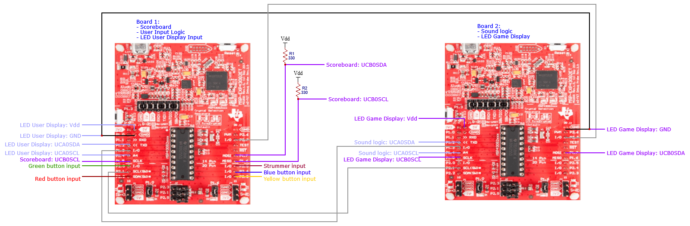

# Guitar Hero 430
### Rice University ELEC 327 Final Project Spring '24

## Table of Contents
1. [Project Description](#project-description)
2. [Team Members](#team-members)
3. [Materials](#materials)
4. [Schematic](#schematic)
5. [File Descriptions](#file-descriptions)
6. [Setting up the LED Displays](#setting-up-the-led-displays)
   - [LED Game Display](#led-game-display)
   - [LED User Display Setup Guide](#led-user-display-setup-guide)
   - [3D-printed Strummer]()
   - [3d-printed LED game display]()
7. [References](#references)
#### Note:
Consider adding STL files or additional notes here.

## Project Description 
This project aims to 

### Team Members
- Natalia Mendiola | nm58@rice.edu
- Lindesy Russ     | ltr1@rice.edu
---

### Materials

* 2x TI LaunchPad Kit with MSP430 (MSP-EXP430G2ET)
* SK9822 LED Strips
* SunFounder I2C LCD1602 Module
* Solderless Breadboard
* 2x 4.4k Resistors
* Jumper wires

### Schematic

----
## File Descriptions

### Board_1

* **Game Logic:**
  - [main.c](./Experimental_Work/game_logic/main.c): File handling the game logic.
  - [rgb_interface_user.c](./Experimental_Work/game_logic/rgb_interface_user.c): File handling the RGB interface for user interaction.
  - [rgb_interface_user.h](./Experimental_Work/game_logic/rgb_interface_user.h): Header file for RGB interface.

* **Serial Communication:**
  - [serial_comm.c](./Experimental_Work/game_logic/serial_comm.c): File handling serial communication.
  - [serial_comm.h](./Experimental_Work/game_logic/serial_comm.h): Header file for serial communication.

### Board 2

* **Game Display Logic:**
  - [main.c](./Experimental_Work/board_2/main.c): File handling the game logic.
  - [rgb_interface.c](./Experimental_Work/board_2/rgb_interface.c): File handling the RGB interface.
  - [rgb_interface.h](./Experimental_Work/board_2/rgb_interface.h): Header file for RGB interface.

* **Audio:**
  - [PlaySong.c](./Experimental_Work/board_2/PlaySong.c): File handling audio playback.
  - [PlaySong.h](./Experimental_Work/board_2/PlaySong.h): Header file for audio playback.

### Experimental_Work 
<i>Please ignore this folder. This is code that is currently in progress. </i>

--- 

## Setting up the LED Displays

### LED Game Display

#### Components Needed:
- SK9822 LED strips
- Jumper wires (male-to-female)
- **cable thing**
- Heat shrink tubing
- Electrical Tape

#### Instructions:
1. **Prepare the LED Strip:**
   - Cut five 7-LED long strips from the SK9822 LED strip.
   
2. **Solder Jumper Wires:**
   - For only ONE LED strip, solder four jumper wires to one end:
     - G (Ground)
     - C (Clock)
     - D (Data)
     - 5V (Power)
   
3. **Attach Female Connectors:**
   - Solder female connectors to the other end of the jumper wires for this LED strip.

4. **Connect LED Strips:**
   - For the remaining four strips, connect each strip to the previous one using **cablething**:
     - Connect G to G, C to C, D to D, and 5V to 5V.
     - Hide the **cablething** behind the LED strips.
     - Daisy-chain the five LED strips together, ending with the jumper wires side.

5. **Secure Connections:**
   - Use electrical tape to secure the **CableThing** behind the LED-facing side of the LED strips, forming a 5x7 LED rectangular shape.
   - Use heat shrink tubing to insulate and secure the jumper wire soldered connections.

**ADD PICTURE OF FINISHED PRODUCT HERE**

## LED User Display Setup Guide
### Components Needed:
- SK9822 LED strips
- Jumper wires (male-to-female)
- Heat shrink tubing

### Instructions:
1. **Prepare the LED Strip:**
   - Cut a 5 LED long strip from the SK9822 LED strip.
   
2. **Solder Jumper Wires:**
   - Solder four jumper wires to one end of the LED strip:
     - One wire for G (Ground)
     - One wire for C (Clock)
     - One wire for D (Data)
     - One wire for 5V (Power)
   
3. **Attach Female Connectors:**
   - Solder female connectors to the other end of the jumper wires.
   
4. **Secure Connections:**
   - Use heat shrink tubing to insulate and secure the soldered connections.

### Usage:
- Connect the female connectors to the corresponding male connectors on your control board or microcontroller.

### Notes:
- Handle the soldering iron and heat shrink tubing carefully to prevent injuries or damage to components.

**ADD PICTURE OF FINISHED PRODUCT HERE**

---

## References

1. 
